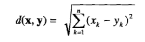
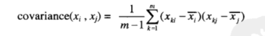

# 第一章：绪论
##    1.1什么是 数据挖掘
        数据挖掘是在大型数据存储库中，自动地发现有用信息的过程。
##    1.2数据挖掘要解决的问题
        可伸缩：需要根据数据的大小和数据结构进行伸缩变换
        高维性：现在大部分数据都是超高维的，随着维度增加，计算将变得异常复杂
        异种数据和复杂数据：现在处理的数据大多数都不是同类别的数据，是各种类型的数据，非常复杂
        数据的所有权与分布：需要分析的数据未必放在一个站点或者属于一个机构，所以需要分布式算法进行分析，则需要考虑如何降低分布式计算的通信量，如何统一从多个资源得到的数据挖掘的结果和如何处理数据安全性。
        非传统的分析：传统统计方法通过设计实验来收集数据，然后针对假设分析数据，大数据情况下基本已经不适用。
##    1.3数据挖掘的起源
        为了解决上述问题，不同学科研究者汇聚一堂，开始研发解决上述问题的工具，通过借鉴统计学、人工智能等学科的思想创建了数据挖掘。
##    1.4数据挖掘任务
        两大类任务：
            预测任务：根据其他属性的值，预测特定属性的值。
            描述任务：导出概括数据中潜在联系的模式。
        具体任务：
            预测建模：涉及以说明变量函数的方式为目标变量建立模型，分两类
                分类：用于预测离散的目标变量
                回归：用于预测连续的目标变量
            关联分析：用来描述数据中强关联特征的模式
            聚类分析：旨在发现紧密相关的观测值组群，使得与属于不同簇的观测值相比，属于同一簇的观测值相互之间尽可能类似。
            异常检测：识别其特征显著不同于其他数据的观测值。
# 第二章：数据
##    2.1数据类型
###        2.1.1属性与度量
            属性：对象的性质或特性，它因对象而异，或随时间而变化。
            测量标度：将数值或符号值与对象的属性相关联动的规则。
            属性的类型：标称、序数、区间、比率
###        2.1.2数据集的类型
            数据集的一半特性：维度、稀疏性、分辨率
##    2.2数据质量
###        2.2.1测量和数据收集问题
            测量误差和数据收集错误
            噪声和伪像
            精度、偏倚和准确率
            离群点
            遗漏值
            不一致的值
            重复数据
###        2.2.2关于应用的问题
            时效性
            相关性
            关于数据的知识
##    2.3数据预处理
###        2.3.1聚集
            将两个或多个对象合并成单个对象。
###        2.3.2抽样
            选择数据对象子集进行分析的常用方法
###        2.3.3维归约
            降维，将相似的特征归为一个或者删除不相关的特征。
###        2.3.4特征子集选择
            提取与问题相关的特征
###        2.3.5特征创建
            由原来的属性创建新的属性集
###        2.3.6离散化和二元化
            将连续属性变换成分类属性
###        2.3.7变量变换
            用于变量的所有值的变换
##    2.4相似性和相异性的度量
###        2.4.1基础
            相似度：两个对象相似程度的数值度量。通常在[0，1]中取值
            相异度：两个对象差异程序的数值度量。通常在[0，+∞]中取值
            通常使用变换把相似度转换成相异度或相反，或者把邻近度变换到一个特定区间
###        2.4.2简单属性之间的相似度和相异性

###        2.4.3数据对象之间的相异度
            欧几里得距离：

            n是维数，xk和yk分别是x和y的第k个属性值
            闵可夫斯基距离：

            闵可夫斯基距离的三个最常见例子：

            距离的性质：非负性、对称性、三角不等式
            满足以上三个性质的测度称为度量
###        2.4.4数据对象之间的相似度
            相似度的性质：
                (1)仅当x=y时s(x,y)=1。(0<=s<=1)
                (2)对于所有x和y，s(x,y)=s(y,s)。（对称性）
###        2.4.5邻近性度量的例子  
            简单匹配系数（SMC）
  

            Jaccard系数

			余弦相似度

			广义Jaccard系数(Tanimoto系数)

			皮尔森相关系数

###        2.4.6邻近度计算问题
			距离度量的标准化和相关性
			组合异种属性的相似度
# 第三章：探索数据
##	3.1鸢尾花数据集
		五个特种：萼片长度、萼片宽度、花瓣长度、花瓣宽度、类	

##	3.2汇总统计
###	     3.2.1频率和众数
			频率：具有某个属性的对象数占总体数量的比率
			众数：具有最高频率的值
###	     3.2.2百分位数
			不解释
###	     3.2.3位置度量：均值和中位数
			均值：
  

			中位数：
  

			截断均值：指定0和100之间的百分位数p，丢弃高端和低端（p/2）%的数据，然后用常规的方法计算均值
###       3.2.4散布度量：极差和方差
			极差：
  

			方差：
  

			标准差：方差的平方根  
			绝对平均偏差：  
  

			中位数绝对偏差：
  

			四分位数极差：
  

###	     3.2.5多元汇总统计
				包含多个属性的数据的位置度量可以通过分别计算每个属性的均值或中位数得到。对于多源数据，每个属性的散布可以独立于其他属性；对于具有连续变量的数据，数据的散步更多地用协方差矩阵S表示，其中S的第ij个元素Sij是数据的第i个和第j个属性的协方差。这样，如果xi和xj分别是第i个和第j个属性，则：

  
				协方差矩阵的对角线上是属性的方差
				两个属性的协方差是两个属性一起变化并依赖于变量大小的度量
###	     3.2.6汇总数据的其他方法
			倾斜度等
##	3.3可视化
###	     3.3.1可视化的动机
			人们能快速吸收大量可视化信息，发现其中的模式。
###       3.3.2一般概念
			1.表示：将数据映射到图形元素
			2.安排：找出隐藏规律，进行可视化
			3.选择：删除或不突出某些对象的属性
###       3.3.3技术
			1.少量属性的可视化：
				茎叶图
				直方图
				二维直方图
				盒状图
				饼图
				百分位数图和经验累计分布函数
				散布图
				扩展的二维和三维图
			2.可视化时间空间数据
				等高线图
				曲面图
				矢量场图
				低维切片
				动画
###       3.3.4可视化高维数据
			矩阵
			平行坐标系
			星形坐标
			Chernoff脸
###	     3.3.5注意事项
			理解：正确察觉变量之间关系的能力
			清晰性：以目视识别图形中所有元素的能力
			一致性：根据与以前的图形的相似性解释图形的能力
			有效性：用尽可能简单的方法描绘复杂的能力
			必要性：对图形和图形元素的需要
			真实性：通过图形元素相对于隐式或显式尺度的大小，确定图形元素所代表的真实值的能力
##	3.4OLAP和多维数据分析
###       3.4.1用多维数组表示鸢尾花数据
			大部分数据集都可以用表来表示，其中每一行是一个对象，每一列是一个属性。在许多情况下，也可以将数据看作多维数组。
###       3.4.2多维数据：一般情况
			用多维数组表示数据需要两个步骤：维的识别和分析所关注的属性的识别。维是分类属性，或是转换成分类属性的连续属性。属性值充当对应于该属性的维的数组下标，而属性值的个数是维的大小。
###	     3.4.3分析多维数据
			1.数据立方体：计算聚集量
			2.维归约和转轴
				维归约：聚集
				转轴：是指在除两个维之外的所有维上聚集。结果是一个二维交叉表，只有两个指定的维作为留下的维。
			3.切片和切块
				切片：通过对一个或多个维指定特定的值，从整个多维数组中选择一组单元
				切块：通过指定属性值区间选择单元子集，这等价于由整个数组定义子数组
			4.上卷和下钻
				上卷：聚集
				下钻：分解
# 第四章：分类：基本概念、决策树与模型评估
##	4.1预备知识
##	4.2解决分类问题的一般方法
##	4.3决策树归纳
###	     4.3.1决策树工作原理
###       4.3.2如何建立决策树
###       4.3.3表述属性测试条件的方法
###       4.3.4选择最佳划分的度量
###       4.3.5决策树归纳算法
###       4.3.6例子：Web机器人检测
###       4.3.7决策树归纳的特点
##	4.4模型分过分拟合
###      4.4.1噪声导致的过分拟合
###      4.4.2缺乏代表性样本导致的过分拟合
###      4.4.3过分拟合与多重比较过程
###      4.4.4泛化误差估计
###      4.4.5处理决策树归纳中的过分拟合
##	4.5评估分类器的性能
###      4.5.1保持方法
###      4.5.2随机 二次抽样
###      4.5.3交叉验证
###      4.5.4自助法
##	4.6比较分类器的方法
###      4.6.1估计准确度的置信区间
###      4.6.2比较两个模型的性能
###      4.6.3比较两种分类法的性能
# 第五章：分类：其他技术
# 第六章：关联分析：基本概念和算法
# 第七章：关联分析：高级概念
# 第八章：聚类分析：基本概念和算法
# 第九章：聚类分析：其他问题与算法
# 第十章：异常检测

