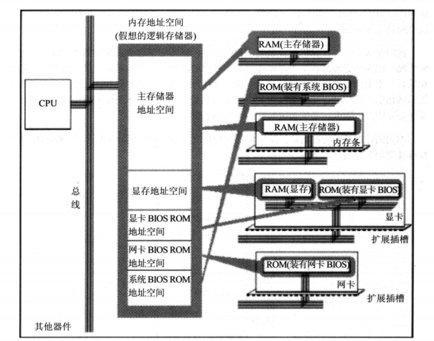
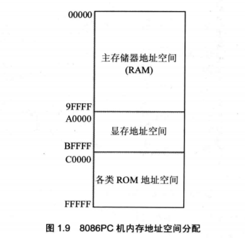
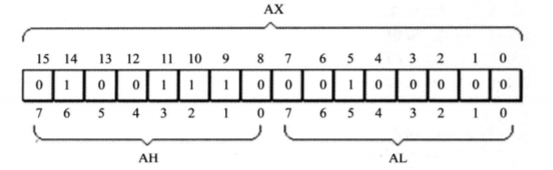
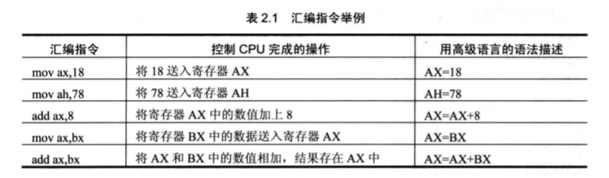
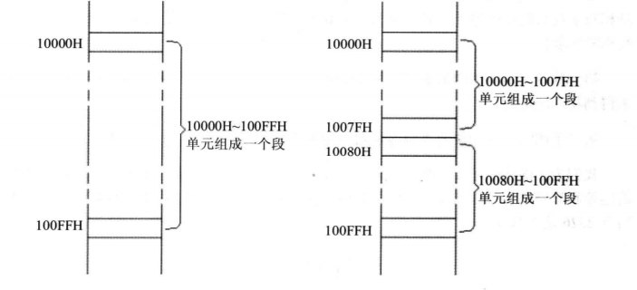

# 第一章：基础知识 
## 1.1：机器语言
		机器语言是机器指令的合集。
## 1.2：汇编语言的产生
		解决机器语言难以理解和记忆。
## 1.3：汇编语言的组成
		汇编语言的组成：
			汇编指令：机器码的助记符，有对应的机器码。
			伪指令：没有对应的机器码，由编译器执行，计算机并不执行。
			其他符号：如+、-、*、/等，由编译器识别，没有对应的机器码。
## 1.4：存储器
		存储器：存储指令和数据的地方。
## 1.5：指令和数据
		指令和数据是应用上的概念。在内存或磁盘中没有区别，都是二进制数据。
## 1.6：存储单元
		存储器被划分为若干个存储单元，每个存储单元从0开始编号。一个单元8bit，即一个Byte。
## 1.7：CPU对存储器的读写
		CPu想进行数据的读写，必须进行地址信息、控制信息、数据信息的交互。
## 1.8：地址总线
		CPU是通过地址总线来指定存储器单元的。一个CPU有N根地址线，则可以说这个CPU的地址总线的宽度是N。这样的CPU最多可以寻找2的N次方个内存单元。
## 1.9：数据总线
		CPU与内存或其他器件之间的数据传送时通过数据总线来进行的。数据总线的宽度决定了CPU和外界的数据传送速度。
## 1.10：控制总线
		CPU对外部器件的控制是通过控制总线来进行的。
## 1.11：内存地址空间
		CPU可以寻址的内存单元
## 1.12：主板
		PC机上的主板拓展槽上一般插有RAM内存条和各类接口卡。
## 1.13：接口卡
		CPU通过总线向接口卡发送命令，接口卡根据CPU的命令控制外设进行工作。
## 1.14：各类存储器芯片
		随机存储器
		装有BIOS的ROM
		接口卡上的RAM
## 1.15：内存地址空间

# 第二章：寄存器
## 2.1 通用寄存器
		
## 2.2 字在寄存器中的存储
	8086CPU低字节存在地位高字节存在高位
## 2.3 几条汇编指令

## 2.4 物理地址
	所有内存单元构成一个一维线性空间，每一个内存单元在这个空间中都有一个唯一的地址，称为物理地址。CPU通过地址总线送入存储器的，必须是一个内存单元的物理地址。
## 2.5 16位结构的CPU
	运算器一次最多可以处理16位的数据
	寄存器的最大宽度为16位
	寄存器和运算器之间的通路是16位
## 2.6 8086CPU给出物理地址的方法
	CPU中的相关部件提供两个16位的地址，一个称为段地址，另一个称为偏移地址
	段地址和偏移地址通过内部总线送入一个称为地址加法器的部件
	地址加法器将两个16位地址合成一个20位的物理地址
	地址加法器通过内部总线将20位物理地址送入输入输出控制电路
	输入输出控制电路将20位物理地址送上地址总线
	20位物理地址被地址总线传送到存储器
## 2.7 “段地址x16 + 偏移地址 = 物理地址”的本质含义
	CPU在访问内存时，用一个基础地址（段地址x16）和一个相对于基础地址的偏移地址相加，给出内存单元的物理地址。
## 2.8 段的概念

## 2.9 段寄存器
	8086CPU有4个段寄存器：CS、DS、SS、ES
## 2.10 CS和IP
	CS和IP指示了CPU当前要读取指令的地址。CS为代码段寄存器，IP为指令指针寄存器。
## 2.11 修改CS、IP的指令
	mov指令不能用于设置CS、IP的值。修改CS、IP的内容，需要用“jmp 段地址：偏移地址”或“jmp 某一合法寄存器”修改IP。
## 2.12 代码段
	将长度为N(N<=64KB)的一组代码，存在一组地址连续、起始地址为16的倍数的内存单元中，可以认为这段内存是用来存放代码的，从而定义了一个代码段。
# 第三章：寄存器（内存访问）
# 第四章：第一个程序
# 第五章：[BX]和loop指令
# 第六章：包含多个段的程序
# 第七章：更灵活的定位内存地址的方法
# 第八章：数据处理的两个基本问题
# 第九章：转移指令的原理
# 第十章：CALL和RET指令
# 第十一章：标志寄存器
# 第十二章：内中断
# 第十三章：int指令
# 第十四章：端口
# 第十五章：外中断
# 第十六章：直接定址表
# 第十七章：使用BIOS进行键盘输入和磁盘读写